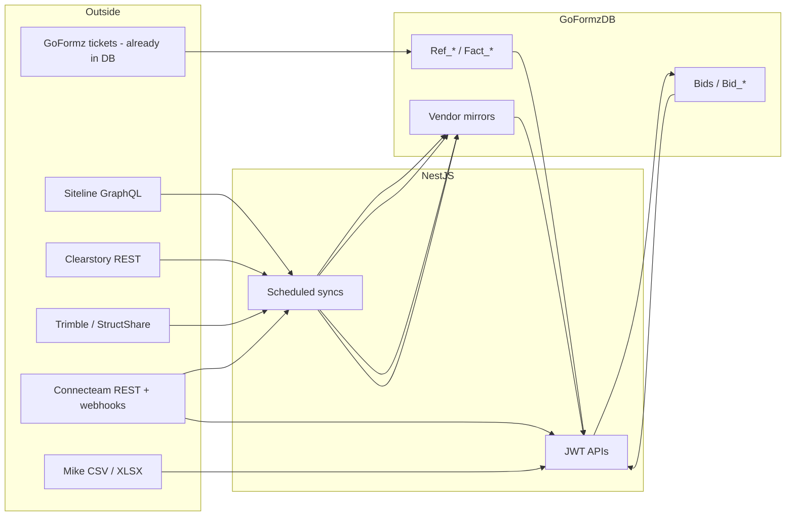
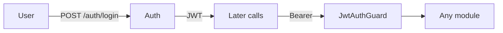
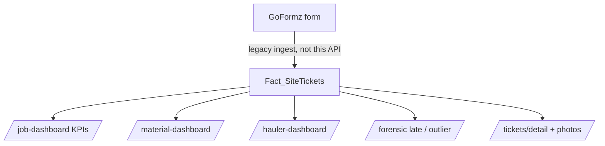
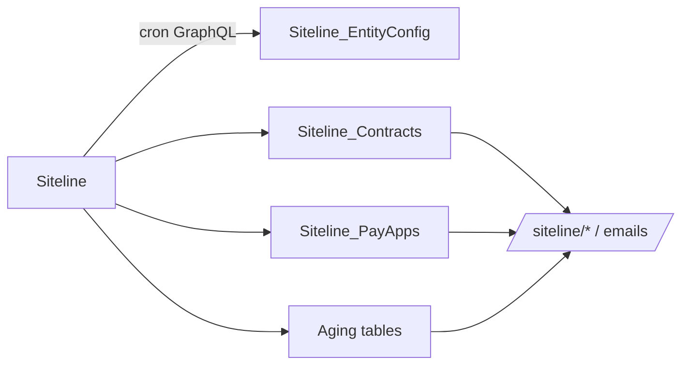
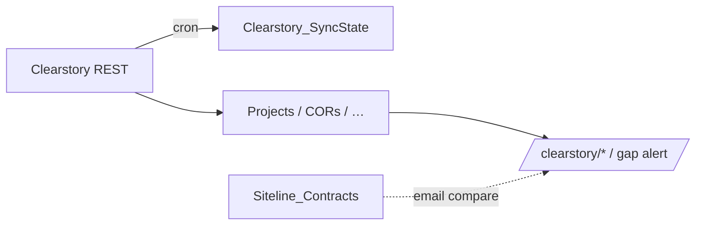
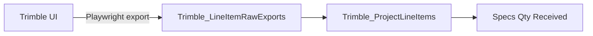
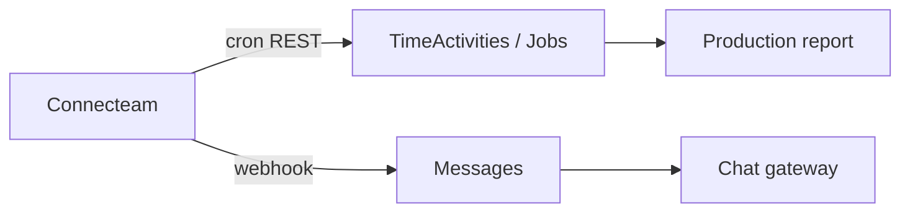
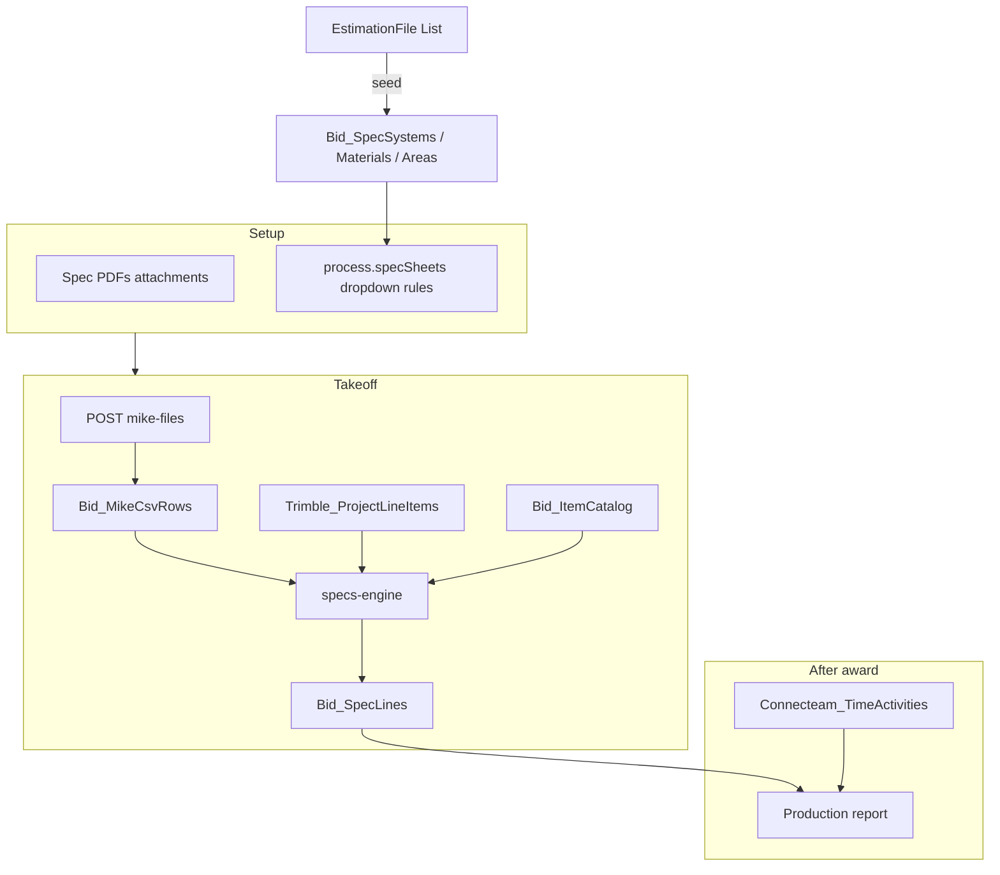
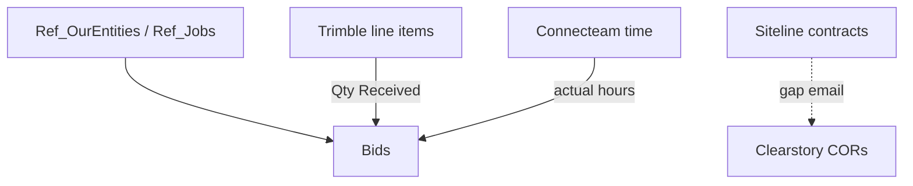

# Backend design

**What this is:** NestJS API (`trucking-dashboard`) in front of SQL Server `GoFormzDB`.  
**Not this:** frontend screens, Excel cell maps, deploy runbooks.

**Visual copy (use this to walk someone through it):**
- [BACKEND_DESIGN.pdf](./BACKEND_DESIGN.pdf) — 8 landscape pages, diagrams
- [BACKEND_DESIGN.docx](./BACKEND_DESIGN.docx) — same slides in Word
- [backend-design.html](./backend-design.html) — source for those files

JWT on every route except a few auth/webhook endpoints. Crons write **mirrors**; UI reads **SQL**, not the vendor live.

---

## 1. What we built

Three layers in one API:

| Layer | Job | Lives in |
|-------|-----|----------|
| **Trucking ops** | Tickets, jobs, KPIs, forensic | `Fact_*` + `Ref_*` (GoFormz-era DB) |
| **Vendor mirrors** | Billing, CORs, materials received, field hours | `Siteline_*` / `Clearstory_*` / `Trimble_*` / `Connecteam_*` |
| **Bidding** | Estimate → takeoff → production hours | `Bids` / `Bid_*` (ours). Links to `Ref_*` + Trimble + Connecteam |

```text
Vendors (Siteline, Clearstory, Trimble, Connecteam)
        │  cron / webhook / Playwright
        ▼
   GoFormzDB  (SQL Server)
        │  JWT REST
        ▼
   NestJS  →  Frontend
```

Companies we bid as (`GOEL` / `GOEL DC` / `DCB`) are **`Ref_OurEntities` only** — never copied into Siteline/Clearstory/Bid company tables.

---

## 2. System flow



**Read path:** FE → JWT → SQL.  
**Write path (integrations):** cron pulls vendor → upsert mirror tables. Connecteam chat also **pushes** via webhook.  
**Write path (bidding):** FE PATCH JSON + file uploads. Math for Specs/production is server-side; Base Bid math is **client** (Excel engine); we store the snapshot.

---

## 3. Database rules

| Prefix | Meaning | Example |
|--------|---------|---------|
| `Ref_*` | Shared masters | `Ref_Jobs`, `Ref_OurEntities` |
| `Fact_*` | Trucking events | `Fact_SiteTickets` |
| `App_*` | Users, roles, settings, files | `App_Users` |
| `Siteline_*` / `Clearstory_*` / `Trimble_*` / `Connecteam_*` | Integration copies | do not use as CRM |
| `Bid_*` | Estimator data with no `Ref_*` home | `Bid_SpecLines` |

No second “our companies” or “haulers for bidding” table. Bidding FKs: `Bids.OurEntityId` → `Ref_OurEntities`, optional `Bids.JobId` → `Ref_Jobs`.

---

## 4. Auth & admin

**What:** Login, JWT, RBAC, user admin, SMTP test, email templates, a few feature flags (`App_Settings`).

**Source:** `App_Users` / `App_Roles` / `App_Permissions` — our tables, not a vendor.

**API:** `/auth`, `/admin/*`



---

## 5. Lookups

**What:** Dropdown data used across dashboards.

**Source:** `Ref_Jobs`, `Ref_Materials`, `Ref_ExternalCompanies` (haulers), `Ref_ExternalSites`, `Ref_OurEntities`.

**API:** `/lookups/*`  
Bidding-only lists (`Bid_Teams`, spec systems, …) are `/lookups/bidding/*` — same pattern, different tables.

---

## 6. Trucking: tickets, jobs, materials, haulers, forensic

**What:** Original product. Site tickets (import/export loads), photos, KPIs, late-entry / efficiency audits.

**Source:** GoFormz filled tickets **already stored** in this DB (`GoFormzID` on the ticket). This API does **not** poll GoFormz. It reports what is in SQL.

**Tables:** `Fact_SiteTickets`, `Fact_TicketPhotos`, `Ref_Jobs`, `Ref_Materials`, `Ref_Drivers`, `Ref_TruckTypes`, `Ref_ExternalCompanies`, `Ref_ExternalSites`.

**API:** `/tickets`, `/job-dashboard`, `/material-dashboard`, `/hauler-dashboard`, `/forensic`



Filter with `entityId` (our company) the same way everywhere.

---

## 7. Siteline (billing / aging)

**What:** Pay apps, contracts, aging, overdue / weekly PM emails.

**Source:** Siteline GraphQL (`api-external.siteline.com`), **one API token per our entity** (GOEL / GOEL DC / DCB). Cron: contracts then aging (~every 6h). Flags: `SITELINE_CONTRACT_SYNC_ENABLED`, `SITELINE_AGING_SNAPSHOT_ENABLED`.

**Tables:** `Siteline_EntityConfig`, `Siteline_Contracts`, `Siteline_PayApps`, `Siteline_AgingSummary`, `Siteline_AgingContracts`.

**API:** `/siteline/*` (reads SQL, not live GraphQL)



`entityId` on reports = `Ref_OurEntities`, mapped via `Siteline_EntityConfig`.

---

## 8. Clearstory (CORs / change)

**What:** Projects, CORs, tags, customers, rates — PM source for change-order vs Siteline gaps.

**Source:** Clearstory REST (`web-api.clearstory.build`). Cron `CLEARSTORY_SYNC_CRON`. Raw payloads kept for debug.

**Tables:** `Clearstory_Projects`, `Clearstory_Cors`, `Clearstory_Tags`, `Clearstory_Customers`, `Clearstory_Contracts`, `Clearstory_SyncState`, `Clearstory_ApiPayloads`, plus office/user/rate/notification mirrors.

**API:** `/clearstory/*`



Gap alert: Siteline job vs Clearstory COR coverage — SQL vs SQL, not live vendor calls at send time.

---

## 9. Trimble / StructShare (materials received)

**What:** Job material line items. Bidding Specs uses this for **Qty Received**.

**Source:** Trimble portal via **Playwright** (no stable public API for the export we need). Cron `TRIMBLE_SYNC_CRON`. Kill switch `TRIMBLE_SYNC_ENABLED`.

**Tables:** `Trimble_Projects`, `Trimble_ProjectLineItems`, `Trimble_LineItemRawExports`, `Trimble_SyncState`.

**API:** `/trimble/*`  
Link to a bid: `Bids.TrimbleProjectId` (often resolved from `Ref_Jobs.JobNumber`).



---

## 10. Connecteam (field time + chat)

**What:** Users, jobs, time clocks/activities, schedules, forms, tasks, chat. Production report compares **earned hours** (Mike/Trimble) vs **actual hours** here.

**Source:** Connecteam REST (`api.connecteam.com`) on cron, plus **inbound webhooks** for chat (`/connecteam/webhooks/inbound`). Optional write-through back to Connecteam.

**Tables:** `Connecteam_Users`, `Connecteam_Jobs`, `Connecteam_TimeActivities`, `Connecteam_TimeClocks`, `Connecteam_Messages`, `Connecteam_Conversations`, … + `Connecteam_SyncState` / `Connecteam_WebhookEvents`.

**API:** `/connecteam/*`



Job number on Connecteam jobs is how production rows match a bid / `Ref_Jobs`.

---

## 11. Bidding

**What:** One estimate from invite → takeoff → proposal → win/lose → (if awarded) production hours.

**Source of truth split:**

| Piece | Where it comes from | Where it sits |
|-------|---------------------|---------------|
| Header (company, job, dates) | User + `Ref_OurEntities` / `Ref_Jobs` | `Bids` |
| Lifecycle (stages, spec **rules**, award/lost) | User | `Bid_Content.ProcessJson` |
| Base Bid / systems / company info | User (Excel-shaped JSON) | `Bid_Content` JSON columns |
| Calc snapshot | Frontend Excel engine | `Bid_CalcSnapshots` |
| Spec masters (system/area/material + **codes**) | `EstimationFile.xlsx` List tab (seed) | `Bid_SpecSystems`, `Bid_SpecAreas`, `Bid_SpecMaterials`, `Bid_HelperMap` |
| Takeoff qty | Mike CSV upload | `Bid_MikeFiles` + `Bid_MikeCsvRows` |
| Specs grid | Engine: Mike stack + Trimble recv + catalog | `Bid_SpecLines` |
| Item catalog | EstimationFile item Database (seed) | `Bid_ItemCatalog` |
| Lookups (team, wage, state…) | Excel VRF / Lists (seed) | `Bid_Teams`, `Bid_WageRates`, `Bid_WageDecisions`, … |
| Files | User upload | `App_Files` + `Bid_Attachments` |
| Production hours | Specs + Connecteam activities | computed on GET, not a third hours table |

**API:** `/bids`, `/lookups/bidding/*`, `/estimation-files`, `/production-reports`

**Do not:** live-call Siteline/Clearstory from bidding. Recv = Trimble SQL. Actual hours = Connecteam SQL.



**Spec sheet codes:** type (`kind`) filters systems **and** materials. Area is one shared list. User picks **names**; GET/PATCH fills `systemCode` / `areaCode` / `materialCode` from those masters.

**Process vs status:**  
`process.stage` = Pre workflow tab.  
`process.outcome` = awarded / lost / … (changeable).  
`Bids.Status` = draft / submitted / archived (locks Estimate math only).

FE handoff: [FRONTEND_BIDDING_CONTEXT.md](./FRONTEND_BIDDING_CONTEXT.md). Schema reuse: [BIDDING_DATABASE_DESIGN.md](./BIDDING_DATABASE_DESIGN.md).

---

## 12. How modules connect (only the real edges)



Siteline and Clearstory are **not** inputs to Specs. Trucking tickets are **not** inputs to bidding.

---

## 13. Sync switches

All in `.env`. Individual `*_SYNC_ENABLED` / `*_ENABLED` flags. Typical cadence: every 6 hours (see each `*_CRON`). Trimble on a laptop with `HEADLESS=false` opens a browser.

Enabling crons against `ts01` writes **production** mirrors.

---

## 14. Module → code

| Module | Folder |
|--------|--------|
| Auth / admin | `src/auth`, `src/admin`, `src/users` |
| Lookups | `src/lookups` |
| Trucking dashboards | `src/job-dashboard`, `src/material-dashboard`, `src/hauler-dashboard`, `src/tickets`, `src/forensic` |
| Siteline | `src/siteline` |
| Clearstory | `src/clearstory` |
| Trimble | `src/trimble` |
| Connecteam | `src/connecteam` |
| Bidding | `src/bidding` (+ `specs/`, `process/`) |
| DB entities | `src/database/entities` |

FE contracts stay in `docs/FRONTEND_*.md`. This file is the map; those files are the screens.
